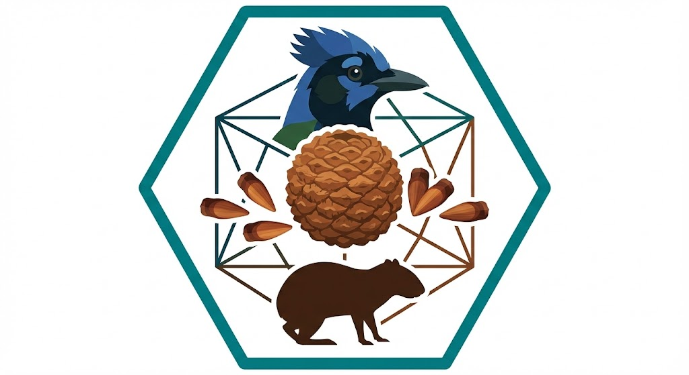

<div align="center">
  

  # Análise de Redes Ecológicas Bipartidas com R

  
  
  

  <p>
    <strong>Material didático para análise de redes de interações ecológicas.</strong>
  </p>

  <h3>
    <a href="https://higuchip.github.io/bipartite-networks-course">
      🚀 Clique aqui para ver a apresentação online
    </a>
  </h3>
</div>

## 📚 Sobre o Curso

Este material foi desenvolvido para a disciplina **Descrição e Análise da Vegetação** do Programa de Pós-Graduação em Engenharia Florestal (PPGEF/UDESC). O curso apresenta conceitos fundamentais de redes ecológicas e suas aplicações práticas em conservação e restauração florestal.

## 📂 Estrutura do Projeto

```text
.
├── index.qmd          # Código fonte da apresentação (R + Texto)
├── index.html         # Apresentação renderizada (pronta para uso)
├── custom.css         # Estilos personalizados
├── index_files/       # Gráficos e recursos gerados
└── README.md          # Este arquivo
```

## 🎯 Objetivos de Aprendizagem

Ao final do curso, você será capaz de:

- Compreender a estrutura de redes bipartidas
- Calcular e interpretar métricas ecológicas (H2, NODF, grau, força, PDI)
- Aplicar modelos nulos para testar significância estatística
- Identificar espécies-chave para conservação
- Simular impactos de extinção e defaunação
- Aplicar análise de redes em projetos aplicados.

## 📋 Conteúdo

### Parte 1: Introdução
- História das redes ecológicas (Caso de Darwin e a orquídea)
- Importância para conservação e restauração
- Aplicações em Engenharia Florestal

### Parte 2: Conceitos Fundamentais
- Anatomia de redes bipartidas
- Generalistas vs. especialistas
- Aninhamento e modularidade
- Especialização (H2)
- Métricas de nível de espécie

### Parte 3: Criando Dados Didáticos
- Espécies da Floresta com Araucária
- Construção de matrizes de interação
- Visualização de redes

### Parte 4: Análises de Rede
- Métricas de nível de rede (`networklevel()`)
- Métricas de nível de espécie (`specieslevel()`)
- Identificação de espécies-chave
- Interpretação ecológica

### Parte 5: Modelos Nulos
- Significância estatística em redes
- Testes de aleatorização
- Visualização de resultados

### Parte 6: Aplicações Práticas
- Priorização de espécies para conservação
- Planejamento de restauração ecológica
- Simulação de extinções
- Impacto da defaunação em fragmentos florestais

## 🛠️ Requisitos

### Software necessário:
- R (versão ≥ 4.0)
- RStudio (recomendado)
- Quarto (para renderizar a apresentação)

### Detalhes Técnicos
- **Codificação**: UTF-8
- **Pacotes Principais**: `bipartite`, `igraph`, `vegan`, `ggplot2`

### Pacotes do R:
```r
install.packages(c(
  "bipartite",
  "igraph",
  "vegan",
  "dplyr",
  "ggplot2",
  "knitr",
  "DiagrammeR"
))
```

## 🚀 Como Usar

### Visualizar a apresentação:

1. Clone o repositório:
```bash
git clone https://github.com/seu-usuario/bipartite-networks-course.git
cd bipartite-networks-course
```

2. Abra o arquivo `index.html` em seu navegador, ou

3. Renderize o arquivo `.qmd` no RStudio:
```r
quarto::quarto_render("index.qmd")
```

### Executar os códigos:

Você pode executar cada chunk de código diretamente no R/RStudio copiando do arquivo `index.qmd` ou trabalhando diretamente no documento Quarto.

## 📊 Dados

Os dados utilizados neste curso são **simulados para fins didáticos**, baseados em espécies reais da Floresta Ombrófila Mista da região de Lages, SC:

- **37 espécies de frugívoros** (24 aves + 13 mamíferos)
- **33 espécies de árvores** produtoras de frutos carnosos
- Dados de frequência de visitação simulados com padrões ecológicos realistas

## 🌳 Contexto Ecológico

O curso utiliza como modelo a **Floresta Ombrófila Mista** (Floresta com Araucária):

- Ecossistema criticamente ameaçado (<10% da área original)
- Importância da dispersão de sementes para regeneração
- Impacto da defaunação em fragmentos florestais
- Aplicações em projetos de restauração ecológica


## 👨‍🏫 Autor

**Pedro Higuchi**
📧 higuchip@gmail.com

Programa de Pós-Graduação em Engenharia Florestal
Universidade do Estado de Santa Catarina (UDESC)

## 📝 Como Citar

Se você utilizar este material, por favor cite:

```bibtex
@misc{higuchi2025redes,
  author = {Higuchi, Pedro},
  title = {Análise de Redes Ecológicas Bipartidas com R},
  year = {2025},
  publisher = {GitHub},
  journal = {GitHub repository},
  howpublished = {\url{https://github.com/higuchip/bipartite-networks-course}}
}
```

## 📄 Licença

Este material é disponibilizado para fins educacionais. Sinta-se livre para usar e adaptar, citando a fonte.

---

**Última atualização:** Novembro 2025
